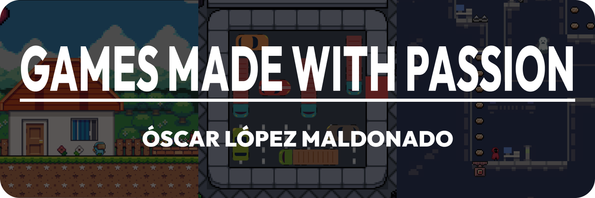
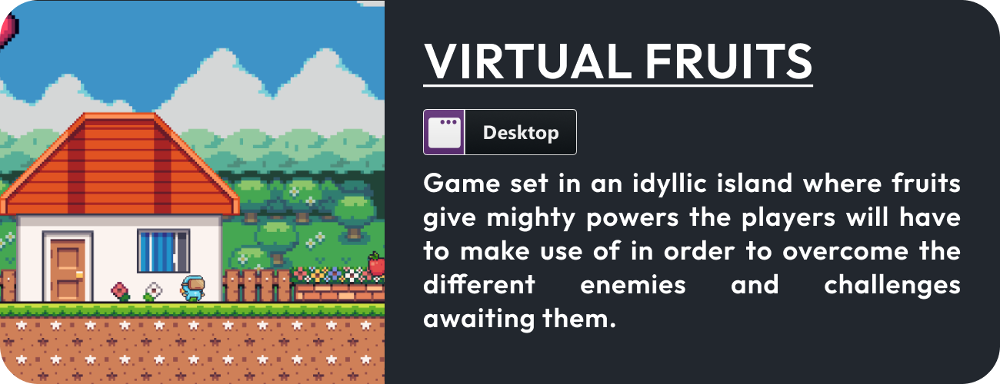
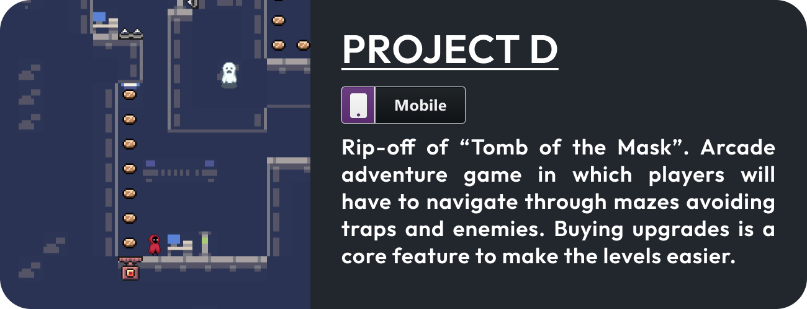
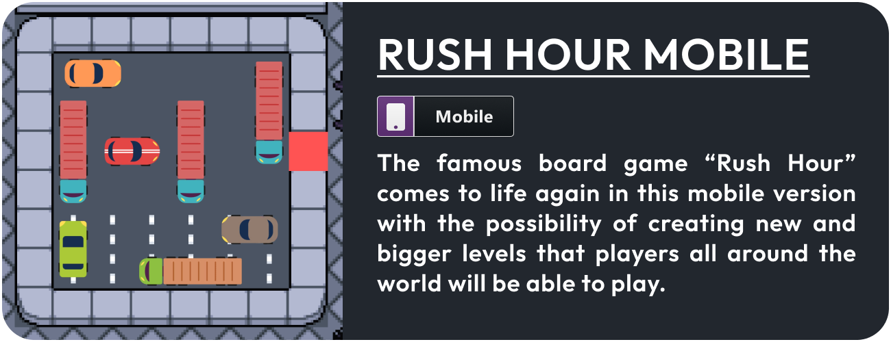

	

<h3 align="justify">
	Altough my time as a gamer and dream to create breathtaking games date back to my early years, it is
	been only for the last 2 years that I have inmersed myself in the
	vast worl of creating videogames. In this two years period I have
	enhanced my skills in both development and design, my projects being proof
	of this improvement.
</h3>

# Development Skills 

<h3 align="justify"> I have developed a series of videogames both for mobile devices and desktop using Unity.</h3>

<!--

-->

&nbsp;&nbsp;&nbsp;
	

# Design Skills

<h3 align="justify">I believe game design to be as important, if not more, than proper development</h3>

# Other Skills

<!-- BADGES

[LANGUAGES]

[DESIGN]

[GAMING]

[OTHER]

-->
